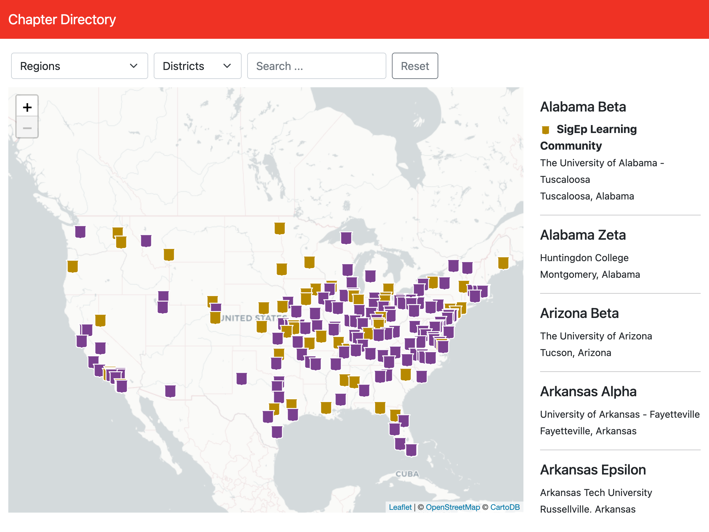

# Chapter Directory

[](https://github.com/stephenyeargin/chapter-directory-rails/actions/workflows/ci.yml) [](https://github.com/utmsigep/chapter-directory-rails/actions/workflows/codeql-analysis.yml)

[](https://chapters.sigep.network)

[Demo](https://chapters.sigep.network)

[Developer Quick Start](https://github.com/utmsigep/chapter-directory-rails/wiki/Developer-Quick-Start)

## Weekly Report Email

`rake report:weekly_summary` emails a copy of the `/admin` dashboard (same stats, comparisons, and rankings) to the addresses in `EMAIL_REPORT_RECIPIENTS` (comma-separated). It only sends on Sundays unless `FORCE=1` is set.

Required environment variables:

- `EMAIL_REPORT_RECIPIENTS` - comma-separated recipient email addresses
- `SMTP_HOSTNAME`, `SMTP_PORT`, `SMTP_DOMAIN`, `SMTP_USERNAME`, `SMTP_PASSWORD` - outbound mail server (falls back to Rails' default `:smtp` config if `SMTP_HOSTNAME` is unset)
- `APP_HOST` - hostname used to build links in the email (defaults to `chapters.sigep.network`)
- `MAIL_FROM_ADDRESS` - the `From` address (defaults to `reports@sigep.network`)

Since Heroku has no built-in weekly cron cadence, schedule this with the [Heroku Scheduler](https://elements.heroku.com/addons/scheduler) add-on to run **daily** (e.g. every morning) - the task itself no-ops on non-Sunday days:

```
rake report:weekly_summary
```
